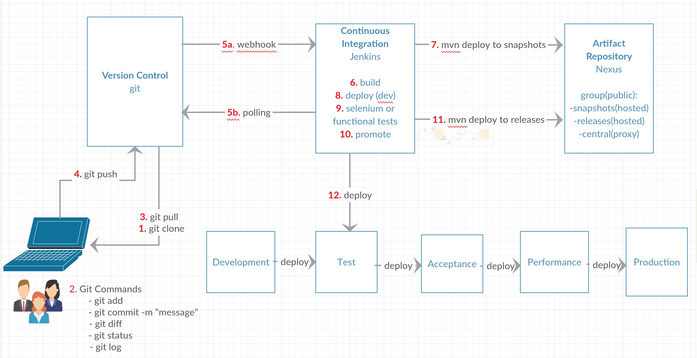

## CI/CD Workflow Diagram

## Jenkins

- Create a folder 'petclinic-demo' inside your local jenkins
- Copy the content from 'jenkins' to petclinic-demo directory in jenkins 'jobs' folder
- Click 'Manage Jenkins' -> 'Reload Configuration from disk'
- Login when the page refreshes
